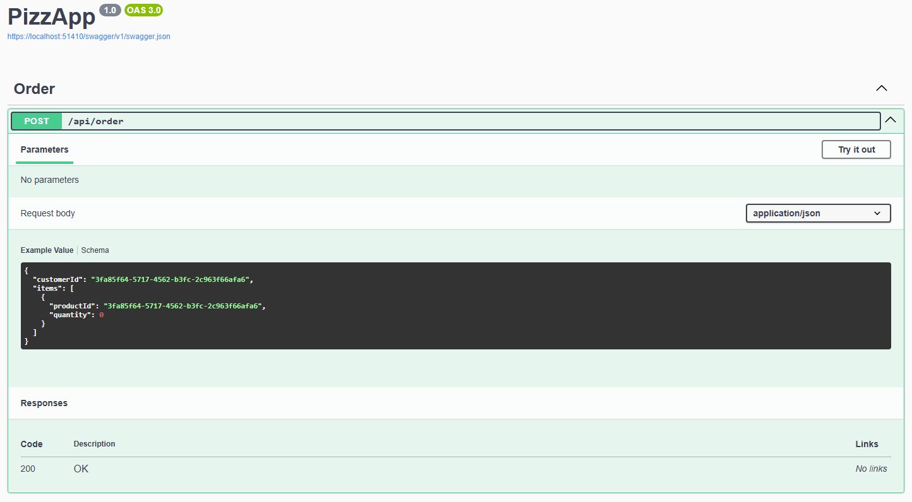

## Introduction

Testing is a important part of building and maintainable applications, in this repository you will explore how to create and run unit tests in **.NET 8** using **NUnit** and **Moq** for mocking dependencies.

## Swagger Tests Cases:

If you want to try some inputs on Swagger, [here](SwaggerTestsCases.md) are some tests scenarios.

## Tools
- C#
- .NET8
- Docker
- NUnit

## Tutorial Links:
[Testing Services on .NET8 with NUnit and Moq](https://dev.to/vinicius_estevam/testing-services-on-net8-with-nunit-and-moq-1em)
